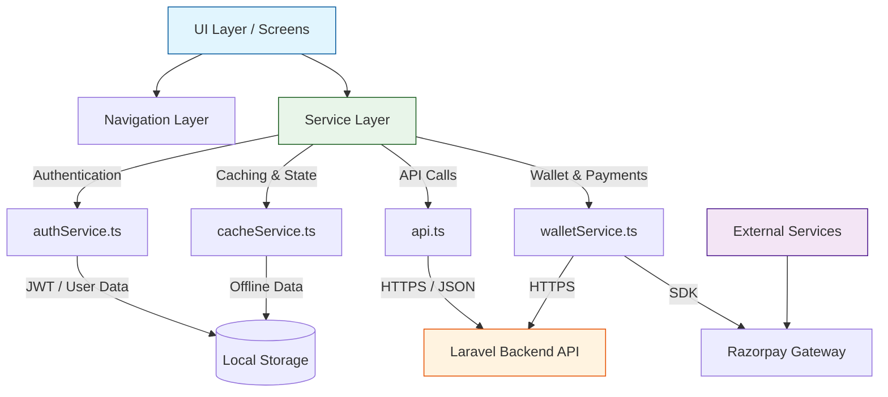

# Architecture Overview

## Folder Structure

The application follows a standard React Native modular structure:

```text
AmarSinghClub/
├── src/
│   ├── components/       # Reusable UI components (Modals, Cards, Buttons, etc.)
│   ├── navigation/       # React Navigation stack & tab definitions
│   ├── screens/          # Application views (Home, Scanner, TopUp, etc.)
│   ├── services/         # API and third-party integrations
│   └── __tests__/        # Jest Unit & Integration tests
├── docs/                 # Documentation files
├── patches/              # patch-package native overrides
├── app.json              # Expo configuration
├── tailwind.config.js    # NativeWind/Tailwind styling config
└── index.ts              # Entry point
```

## System Architecture



## Core Modules

### 1. `walletService.ts`
Manages all wallet-related operations, including checking balance, fetching transactions, processing QR code scanner payments (`pay()`), creating Razorpay orders, and approving payments (`approveOrder()`).

### 2. `authService.ts`
Handles user login, logout, and token persistence using `@react-native-async-storage/async-storage`.

### 3. `api.ts`
The core Axios instance configured with base URL and interceptors. It automatically injects the Bearer token into outgoing requests and provides structured error handling.
